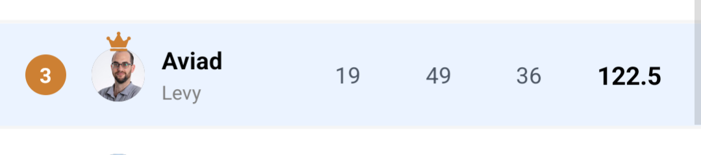
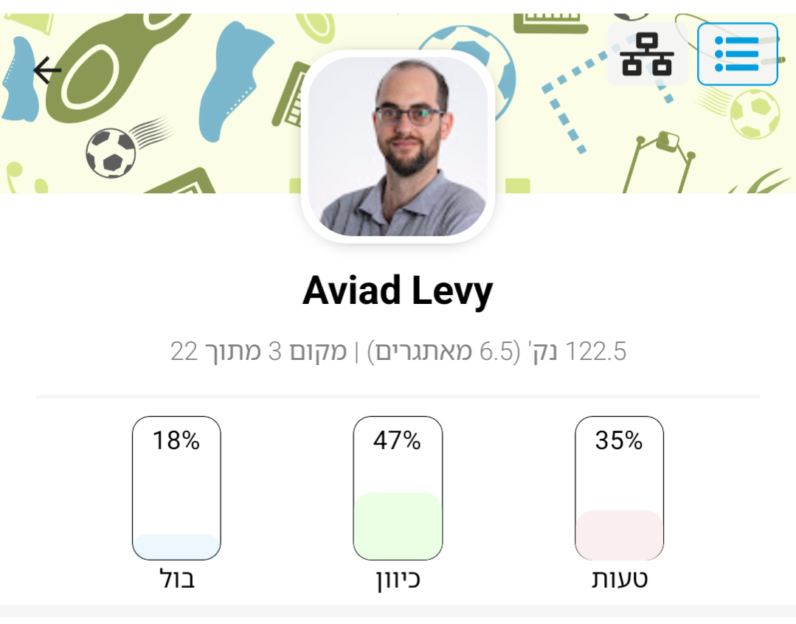

# ⚽ World Cup Prediction Agent — running an office pool with Claude Code

> I entered my company's World Cup 2026 prediction pool (~20 players) and, instead of guessing, I built an **agentic system**: a reusable prediction *skill*, a market-driven methodology, self-scheduling daily checks, and memory that survives across sessions.
>
> **Result:** **3rd of ~20.** I led the pool wire-to-wire for weeks and finished on the podium — and the system was the best-performing *process* in the room: the **most "bullseye" (exact-score) hits of anyone in the pool by a distance** (19; next best 14), plus a high direction-hit rate on top. And the kicker: **on the prediction ledger alone — everyone's points minus the zero-sum side-bets — I finished 1st in the pool** (116 to the next best 113). Both players who beat me on the final total did it *entirely* in the side-bet lane, a variance game I deliberately sat out to protect a guaranteed-paying spot. Best process, third place. That gap — picks vs. side-bets — is the whole story.

This repo is both the **write-up** and the **working system**. Everything the agent used is here — the skill, the data adapters, the cron definitions, the prediction log — so you can see exactly how it worked, not just read about it.

---

## Contents

- [TL;DR](#tldr)
- [The setup](#the-setup) 
  - [The side-bets: "challenges"](#the-side-bets-challenges)
- [The system](#the-system)
- [The methodology: markets as a probability oracle](#the-methodology-markets-as-a-probability-oracle)
- [The turning points](#the-turning-points-the-actually-interesting-part)
  - [1. The draw-trap](#1-the-draw-trap)
  - [2. Provisional picks and a daily firming loop](#2-provisional-picks-and-a-daily-firming-loop)
  - [3. A bias-free agent for the final](#3-a-bias-free-agent-for-the-final)
  - [4. Strategy is a function of your position](#4-strategy-is-a-function-of-your-position)
  - [5. I didn't take the agent for granted](#5-i-didnt-take-the-agent-for-granted)
- [Results](#results)
- [For the builders](#for-the-builders-what-made-this-work-as-an-agent-project)
- [Repo guide](#repo-guide)

---

## TL;DR

- **The job:** predict exact scorelines for all 104 World Cup fixtures in an office pool, and manage the bets as the tournament unfolds.
- **The idea:** don't predict from vibes. Treat a **prediction market (Polymarket) as a probability oracle**, cross-check with **live form data (ESPN)**, and always bet the **highest-expected-value** option.
- **The build:** a Claude Code **skill** (`/mondial`) that knows the schedule, pulls live odds, and records picks — plus **cron jobs** that re-check my bets every day and only ping me when something *actually* changed.
- **The interesting part:** the *pivots*. The "draw-trap" that quietly cost me knockout games (once the knockout scoring rule was in play — a rule I should have briefed the agent on sooner). Shifting strategy from "protect the lead" to "chase from behind" when I got overtaken.

---

## The setup

A work pool on a betting app: ~20 colleagues, prizes for **1st and 2nd**. You predict an **exact scoreline** for every match, plus two season-long **futures** (tournament winner, top scorer). Scoring turned out to be the crux of the whole thing (more below):

| Stage | Correct outcome (direction) | Exact score (bullseye) |
|---|---|---|
| Group / Round of 32 | +1 | +3 |
| Round of 16 | +2 | +4 |
| Quarter-final | +3 | +6 |
| Semi-final | +4 | +8 |
| 3rd place / Final | +5 | +10 |
| Winner / Top-scorer futures | — | +10 each |

Two things that quietly shaped every decision: **exact scores are worth 2–3× the "just get the winner right" points**, and in the **knockouts only the result at 90 minutes counts** (a game won on penalties is scored as a *draw*).

### The side-bets: "challenges"

Running alongside the exact-score predictions is a second game entirely. Every fixture also has optional **challenges** — side-bets published to the whole team, where anyone can join either side of a yes/no or two-option question ("Over/Under 2.5 goals", "Does *[player]* score?", "Which team scores first?"). The catch that makes them matter: you wager your own **leaderboard points**, and it's **zero-sum** — winners split the losers' staked points; a wrong bet *loses* your stake. Payout scales with how contrarian you were: a few winners splitting many losers' stakes means a lone correct player can bank a big haul (one player took **+15** off a single challenge). This is the pool's **variance lane** — mostly a trap for a leader, the only real ladder for a chaser — and it decides the endgame (see [turning point #4](#4-strategy-is-a-function-of-your-position) and the results).

---

## The system

```
world-cup-prediction-agent/
├── README.md                     ← you are here (the story)
├── JOURNAL.md                    ← chronological devlog + turning points
├── docs/
│   ├── methodology.md            ← Polymarket-as-prior, EV, direction-scoring, variance
│   └── automation.md             ← crons, the restore hook, memory, provisional picks
├── .claude/
│   ├── skills/mondial/
│   │   ├── SKILL.md              ← the skill: how the agent makes a pick
│   │   ├── schedule.json         ← all 104 fixtures, kickoff times, venues
│   │   ├── polymarket.md         ← verified market API calls + parsing
│   │   ├── espn.md               ← free results/standings API (the form layer)
│   │   ├── predictions.json      ← every pick, with reasoning + result
│   │   └── cronjobs.json         ← the scheduled-job definitions (for restore)
│   └── settings.json             ← SessionStart hook that offers to restore crons
├── CONTEXT.md · FUTURES.md       ← domain glossary + futures research
└── assets/                       ← leaderboard & scoring screenshots
```

**Four moving parts:**

1. **The skill (`/mondial`).** A [Claude Code skill](https://docs.claude.com/en/docs/claude-code) is a packaged set of instructions the agent loads on demand. Mine encodes the *method*: read the schedule, pull Polymarket for the fixture, cross-check ESPN form and injuries, pick the highest-EV scoreline, and log it. It's the single source of truth for "how do we make a pick."

2. **Data adapters.** Two no-auth HTTP sources, documented as verified command recipes:
   - **Polymarket** — per-match exact-score markets. Prices ≈ probabilities. This is the *prior*.
   - **ESPN** — live results & standings (the form layer, added after I realized the market price alone hides *how* a team got there).

3. **Automation (cron).** A daily job re-checks every upcoming pick against the current market and fresh team news, and **only notifies me if a bet should change**. A chain of one-shot reminders walks the tournament round-by-round (group → R32 → R16 → QF → SF → final), each one resolving the next round's bracket and scheduling the next reminder.

4. **Memory.** Persistent notes (standings, the scoring structure, the strategic situation) so a fresh session instantly knows "where do I stand and what's my plan," without re-deriving it.

See [`docs/automation.md`](docs/automation.md) for how the cron/hook/memory pieces fit together (including the annoying-but-instructive detail that these jobs are *session-only* and had to be made restorable).

---

## The methodology: markets as a probability oracle

The core bet is philosophical: **a liquid prediction market is a better forecaster than my opinion.** So for every game the agent pulls Polymarket's exact-score market, reads the prices as probabilities, and takes the highest-EV scoreline — full stop, no gut, no "but I have a feeling about this one."

The refinements that mattered:
- **Form as a cross-check, not an override.** ESPN gives each team's actual results. A 7-1 demolition or a leaky defense is signal the single market price flattens. It breaks ties; it doesn't overrule the market.
- **Multi-model voting panels** for the high-stakes one-off calls (winner, top scorer, opening weekend): run the same prompt through several models and aggregate.
- **Pure EV.** No contrarian "pick something no one else will" logic — just the highest-probability option, every time. (That turned out to be exactly why I won early rounds; see results.)

Full write-up in [`docs/methodology.md`](docs/methodology.md).

---

## The turning points (the actually-interesting part)

A plan that never changes isn't a real project. Here are the pivots — each one is a small lesson.

### 1. The draw-trap
A pool rule I already knew but — my bad — didn't brief the agent on at setup: **in the knockouts only the 90-minute result counts** (a game won on penalties is scored as a *draw*). Because I hadn't stated it up front, the early knockout picks over-optimized the exact score until I flagged the rule. Once it was in play, it had one recurring real-world cost — the **draw-trap**: a **heavy favorite that gets dragged to a 1-1 at 90 and wins on penalties is a *draw* for scoring**, so a "favorite to win" bet *loses*. This bit me repeatedly (favorites held level, then advancing on penalties). The fix: rate every knockout tie for "draw-trap risk," and back the draw when two evenly-matched or fatigued sides are likely to still be level at 90.

### 2. Provisional picks and a daily firming loop
Exact-score markets for later games don't open until a few days out. So the agent records a **provisional** pick (favorite + heuristic) and flags it; the daily cron then **firms it to the live market** the moment it opens — and pings me only if the firm pick differs. Bets are never left stale, and I'm never spammed.

### 3. A bias-free agent for the final
Late in the tournament I *needed* one specific team to win the final (for standings reasons). That's exactly when your judgment is worthless. So I spawned a **clean sub-agent that had no idea about my standings or what I was rooting for** — just "predict this match objectively." It came back with the opposite of what I wanted (the team I needed was the *underdog*). Painful, but honest — and it let me separate "what I hope" from "what I bet."

### 4. Strategy is a function of your position
- **Leading?** Play **low variance** — take the chalk, stay correlated with the field, don't gamble.
- **Chasing?** You *need* variance — being right *with* the crowd doesn't close a gap; you have to be right where the crowd is *wrong*.
- **The challenges are the variance lane** — and this is how I got caught. Betting them risks your points, and being right *with* the crowd barely pays (everyone splits a small pot), so a leader should mostly *skip* them. I did: I led by playing the main predictions safe and sitting out most challenges to protect my points. Two colleagues did the opposite, and both got past me on the last night. **Colleague 2** — sitting around 86 points — banked **+32.5 in a single night** on the final's zero-sum challenge duels, the variance lane doing exactly what it's built to do for a chaser: bank points by being right where the crowd, and the leader, were wrong. And **Colleague 1**, even holding the Spain + Mbappé futures I'd passed on, was *still* behind me on the prediction ledger (113 to my 116) — it was his **+45 in side-bets** that pushed him clear. Same lane, same lesson: a chaser converting variance the leader had no reason to touch. Playing pure defense kept my points safe and still wasn't enough: a late leader can't fully sit still while the lane behind him can move 30+ points in a night.
- **When 2nd place also pays**, the calculus flips again: protect the secure prize, and only chase 1st with moves that can't cost you points. This is the cruel twist once you've been overtaken — catching up now *requires* the challenge lane, but gambling those points risks a prize you already hold.
- **Bet correlated with the world where you can still win.** On the final, the max-EV bet and the bet that helps my *title* pointed opposite ways — because my points only mattered in the branch where the underdog won. So I ran **two tracks at once**: the objective EV pick for points (Spain 1-0), and title-aligned longshots (rooting for Argentina, an "Argentina scores first" lean), at **modest stakes** so a swing at 1st could never cost me the paying 2nd. The EV pick and the title pick were simply different objectives, and I stopped trying to make one bet do both jobs.
- **The futures double-threat, in context.** Once France was knocked out, **Mbappé became the outright top-scorer leader** — so Colleague 1 held *both* the Spain-winner and Mbappé futures, two live +10s only a Messi goal could flip. It felt uncatchable at the time. The ledger says otherwise: those +20 narrowed his gap but left him *still behind me on picks* — it was the side-bet lane, not the futures, that decided it. The strategic point still stands, though: futures you locked in June give you no lever left to pull in July.

### 5. I didn't take the agent for granted

The whole system defers to the market and executes on its own — but the calls that actually moved the needle came from me arguing with it, not rubber-stamping it. I was a skeptical director, not a passenger. Concrete examples:

- **I overruled the model on the futures.** A 4-model voting panel was unanimous (Spain to win, Mbappé top scorer). I entered **France + Kane** on my own read — logged honestly as my call, not laundered as the system's.
- **I caught the agent's mistakes.** It resolved a knockout bracket to the *wrong opponent* (an Australia tie that was actually Egypt), and mis-recorded a pick. Blindly trusting either would have meant researching and betting the wrong match.
- **One gap was on me, not the agent.** I already knew knockouts score the 90-minute result, not the exact score — I just didn't brief the agent on it at setup, so early knockout picks over-optimized the exact score until I flagged the rule. A communication gap I should have closed sooner, not a heroic catch.
- **I corrected its reasoning.** That the final is the last game so you can't "wait and see" the winner future; how the side-bet pool actually works (zero-sum, wagers your points); and that **2nd place also pays** — each one reframed the strategy.
- **I forced it to be objective when I couldn't be.** I spawned the bias-free agent for the final *because* I knew I wanted a result and didn't trust the agent (with my standings in memory) or myself to stay honest.
- **I chose my own risk tolerance.** At several points I played safe against the agent's more aggressive framing — my money, my call.

The lesson: the agent is a tireless analyst and a flawless executor, but the human's domain knowledge, skepticism, and risk judgment were decisive. The wins came from the *combination* — trusting either alone would have done worse.

---

## Results

**Final: 3rd of ~20, 122.5 points — but 1st on the prediction ledger.** I led the pool wire-to-wire for most of the tournament (1st with 115 after the quarter-finals) and finished on the podium. Strip out the zero-sum side-bets and I finished **first on picks alone**; the top two passed me only in that side-bet lane. The final top three, anonymized (points shown as total = predictions + side-bets):

| # | Player | Total | Predictions | Side-bets | How the ending was won |
|---|---|---|---|---|---|
| 🥇 | **Colleague 1** | 158 | 113 | **+45** | Futures cashed (Spain + Mbappé, +20) — but still behind me on picks; **+45 in side-bets** is what carried him to 1st. |
| 🥈 | **Colleague 2** | 133.5 | 95 | **+38.5** | From ~86 on **+38.5 in side-bets** (incl. **+32.5 in one night**) on the final's zero-sum duels. Pure variance lane. |
| 🥉 | **Me (Aviad)** | 122.5 | **116** | +6.5 | **1st on predictions** — sat the side-bet lane out. Most exact-score hits by far: 19, next best 14. |



*Final leaderboard row — 3rd on **122.5 points**, with the season's pick breakdown: **19 exact-score (bullseye) · 49 correct-direction · 36 miss** across all 104 matches (18% / 47% / 35%).*

**The market-as-prior method was the pool's best-performing process — and the numbers say so on both fronts.** I finished with the **most bullseye (exact-score) hits of anyone in the pool by a distance — 19 to the next best 14** — and, since an exact score is worth 2–3× a merely-correct outcome, that precision is what built and held the lead for weeks. On top of it I ran a **strong direction-hit rate** too. (I won't overclaim: a couple of colleagues edged me on *raw* direction hits — this was never the most outcomes-correct card, it was the most *precise* one, and precision is where the points live.) The boring process, applied without deviation, out-predicted the rest of the field going on vibes. Where it mattered most — exact scores — nobody in the pool was close.

**So why 3rd and not 1st? The flip happened entirely in the side-bet lane — not the picking.** Rank the pool on predictions alone (everyone's total minus the zero-sum challenges) and I'm **1st on 116**, ahead of Colleague 1 (113) and Colleague 2 (95). Both players who finished above me got there *only* by working the challenge lane I deliberately sat out:

1. **Colleague 2's one-night challenge heater.** From ~86 points he banked **+32.5 in a single night** (+38.5 total in side-bets) on the final's zero-sum duels — the variance lane doing exactly what it's built to do for a chaser. I was leapfrogged by that, not out-predicted.
2. **Colleague 1 worked the same lane.** The Spain + Mbappé futures I'd passed on both cashed (+20) — but even with them, his prediction total (113) was still *below* mine. His **+45 in side-bets** is what actually carried him to 1st. The futures stung; they didn't decide it.

And my own futures? Overriding the panel to back **France + Kane** cost me ~20 relative points and made the final night rough — but the ledger is unambiguous: **even with both futures dead, I still had the most prediction points in the pool.** The side-bet lane, not the futures, is where 1st and 2nd were settled.



*The receipt: **122.5 total, only 6.5 of them from side-bets ("מאתגרים")** — so **116 on predictions alone**, the pool's highest. The bars are my accuracy: 18% exact-score, 47% correct-direction, 35% miss.*

**And 2nd was a matter of minutes.** My final pick was **Spain 1-0**, the objective EV play. Spain won 1-0 — but the goal came in **extra time**, and knockouts score the 90-minute result (0-0), so the pick scored nothing. Had it landed in regulation: **+10 for me → 132.5**, while Colleague 2 (who bet the 1-1 draw and took +5 on the 0-0) drops **−5 → 128.5**. I take **2nd outright — side-bet heater and all.** The pick was right; it was ~15 minutes late.

**The two-track final.** My final main pick was the objective EV play — **Spain 1-0** (Spain's signature clean-sheet win: one goal conceded all tournament). It **missed**: 0-0 at 90, Spain settled it **in extra time**, so the scoreline died and the direction points with it. My one final challenge bet — **Under 2.5 goals — won (+7.5)**. I deliberately kept challenge stakes modest: 2nd was a paying spot and I was protecting it, unwilling to gamble a guaranteed prize for a swing at a better one. In the end I slipped to 3rd anyway — leapfrogged by Colleague 2's heater — but that's variance landing, not a stake I could have safely covered.

**Process beat outcome, and that's the honest lesson.** Market-as-prior plus pool-best exact accuracy was a genuine edge: it led the field for weeks and finished **1st on the prediction ledger**. What changed the final standings wasn't the picking — it was the **zero-sum challenge lane**, where two chasers banked points I couldn't match without risking the guaranteed-paying spot I was there to protect. Missing my futures (France + Kane) made the final night sting, but even with them dead I still had the most prediction points in the pool; the side-bets, not the futures, decided the podium. The lesson I'll keep: in a pool where challenge duels can swing 30+ points in a night, a late leader *can't* fully sit still — pure defense protected my points and still left the door open in the one lane I wasn't playing. The part of the game I could control — reading the market into precise picks — I won. Best process in the room, third place — and I'd run it exactly the same way again.

**Honest ledger** (full record in [`predictions.json`](.claude/skills/mondial/predictions.json), wins *and* losses):

- **Both futures missed** — France (winner) and Kane (top scorer), my overrides of a unanimous panel. The panel was right; I wasn't.
- **The draw-traps** that cost knockout games (M96 Switzerland–Colombia, M100 Argentina–Switzerland, M102 the SF draw pick) — logged with their reasoning, right process or not.
- **3rd place, M103:** firmed **France 2-1**, and it was a **10-goal shootout — England 6-4 France.** I read England's defense as leaky and was right about the goals; I was wrong about the winner. Miss.
- **The final, M104:** **Spain 1-0** missed on the 0-0-at-90 → extra-time result. The companion **Under 2.5 challenge won (+7.5).**

---

## For the builders: what made this work as an *agent* project

- **A skill is a contract.** Putting the method in `SKILL.md` meant every session — days apart — made picks the *same* way. The method improved by editing one file, not by re-explaining.
- **Automations must survive restarts.** The cron jobs were session-only; I made them restorable via a saved `cronjobs.json` + a `SessionStart` hook that offers to recreate them. (Details in [`docs/automation.md`](docs/automation.md).)
- **Memory turns sessions into a continuous project.** "You're 2nd, −3, here's the plan" living in memory meant no cold starts.
- **Sub-agents for breadth and for honesty.** Parallel agents did per-tie deep research; a lone bias-free agent kept me from fooling myself.
- **Human-in-the-loop by design.** The agent never locked a bet on its own — it recommended, I confirmed. Several of my manual overrides hit; a couple missed. That's the point.

---

## Repo guide

| Path | What it is |
|---|---|
| [`JOURNAL.md`](JOURNAL.md) | The chronological story, with dated turning points |
| [`docs/methodology.md`](docs/methodology.md) | The prediction method in depth |
| [`docs/automation.md`](docs/automation.md) | Crons, the restore hook, memory, provisional picks |
| [`.claude/skills/mondial/`](.claude/skills/mondial/) | The actual skill + data adapters + prediction log |
| [`.claude/settings.json`](.claude/settings.json) | The SessionStart restore hook |

*Names of other players are anonymized. This was a private office pool; identifying details are removed.*
